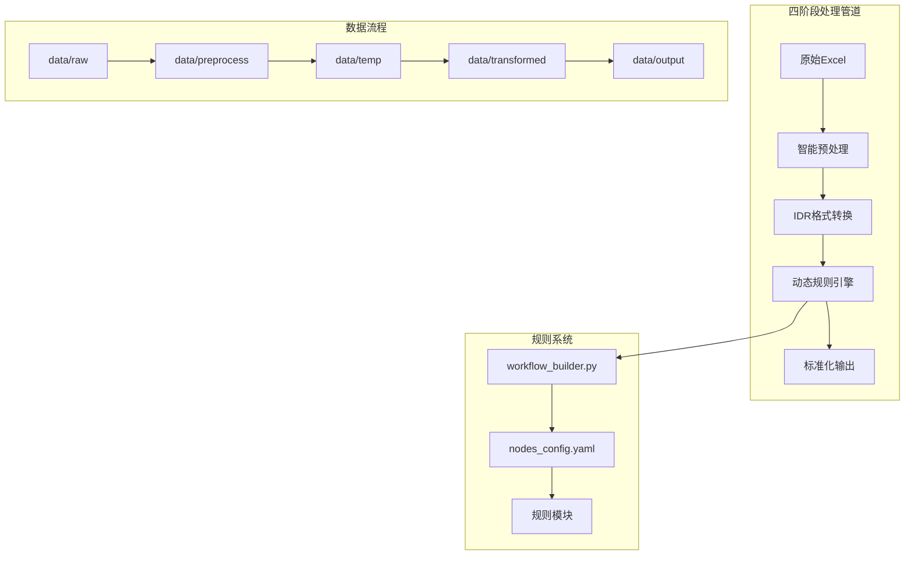

<p align="center">
  
  
  
  
  
</p>

> ⚠️ **重要提示**：本项目为技术概念验证原型，请勿直接用于生产环境。详见[技术决策文档](docs/TECHNICAL_DECISION.md)。

<h1 align="center">ExcelConvert</h1>

<p align="center">
  <strong>基于 LangGraph 的智能 Excel 数据转换引擎</strong>
</p>

<p align="center">
  通过动态规则系统实现零编码适配各种 Excel 格式
</p>

<p align="center">
  <a href="#-快速开始">快速开始</a> •
  <a href="#-核心特性">特性</a> •
  <a href="#📖-文档">文档</a> •
  <a href="#🚀-安装">安装</a> •
  <a href="#💡-使用示例">示例</a>
</p>

---

## 📋 目录

- [🚀 快速开始](#-快速开始)
- [✨ 核心特性](#-核心特性)
- [🏗️ 架构设计](#️-架构设计)
- [💡 使用示例](#-使用示例)
- [🔧 动态规则系统](#-动态规则系统)
- [📊 性能指标](#-性能指标)
- [📖 文档](#-文档)
- [🤝 贡献](#-贡献)
- [📄 许可证](#-许可证)

---

## 🚀 快速开始

### 环境要求

- Python 3.8+
- 8GB+ 内存（处理大文件时）
- 1GB+ 可用磁盘空间

### 一键运行

```bash
# 克隆项目
git clone https://github.com/your-username/ExcelConvert.git
cd ExcelConvert

# 安装依赖
pip install -r requirements.txt

# 处理所有文件
python main.py
```

### 自定义处理

```bash
# 处理单个文件
python main.py -i data/your_file.xlsx

# 批量处理目录
python main.py -i /path/to/excel/files/ --batch

# 跳过预处理（已清洗数据）
python main.py -i clean.xlsx --skip-preprocessing

# 指定输出文件
python main.py -i input.xlsx -o output/result.xlsx
```

---

## ✨ 核心特性

### 🎯 零编码适配
通过配置文件驱动，快速适应新的Excel模板，无需修改代码

### ⚡ 极速部署
新模板上线时间从**数周缩短到数小时**

### 💰 成本优势
开发成本降低 **80%**，维护成本降低 **60%**

### 🔧 灵活扩展
动态规则系统，支持热加载，规则独立开发和测试

### 📋 清晰流程
基于 LangGraph 的规则执行流程，通过配置文件定义执行顺序

---

## 🏗️ 架构设计

### 系统架构图



### 核心组件

| 组件 | 描述 | 语言 |
|-----|-----|-----|
| **excel_preprocess.py** | Excel预处理，清理无用数据 | Python |
| **excel_to_json.py** | 转换为IDR中间格式 | Python |
| **json_transformer.py** | LangGraph规则引擎 | Python |
| **json_to_excel.py** | 生成最终Excel | Python |

---

## 💡 使用示例

### FBA箱号智能格式化

```python
# 输入
"FBA193ZMDQGPU000001-10"

# 输出
["FBA193ZMDQGPU000001", "FBA193ZMDQGPU000010"]
```

### 价格自动计算

```python
# 输入
{
  "total_boxes": 10,
  "units_per_box": 9,
  "unit_price": 3.5
}

# 输出
{
  "total_units": 90,
  "total_value": 315.00,
  "currency": "USD"
}
```

---

## 🔧 动态规则系统

ExcelConvert 的核心优势是**动态规则系统**，让添加新业务规则变得极其简单：

### 快速添加规则（3步完成）

1. **创建规则文件**
```bash
cp rules/_template.py rules/my_rule.py
```

2. **编写业务逻辑**
```python
def apply_my_rule_rule(data: dict) -> dict:
    """您的业务逻辑"""
    if "field_name" in data:
        data["field_name"] = process_data(data["field_name"])
    return data
```

3. **启用规则**
```yaml
# rules/nodes_config.yaml
my_rule:
  module: my_rule
  function: apply_my_rule_rule
  enabled: true
```

### 示例文件说明

- **`_template.py`** - 规则模板文件，包含标准结构和示例代码
- **`price_validation.py`** - 完整的价格验证示例，展示如何编写复杂规则

### 规则优势

| 优势 | 传统方式 | ExcelConvert |
|-----|---------|------------------|
| 开发周期 | 2-5天 | 0.5-1天 |
| 编码需求 | 必须 | 无需 |
| 测试复杂度 | 高 | 低 |
| 维护成本 | 高 | 低 |
| 上线速度 | 慢 | 快 |

详细的规则开发指南请参考：[rules/README.md](rules/README.md)

---

## 📊 性能指标

| 指标 | 数值 | 说明 |
|-----|-----|-----|
| 单文件处理时间 | <30秒 | 10MB文件 |
| 内存占用 | <1GB | 峰值内存 |
| 规则开发周期 | 0.5-1天 | 从需求到上线 |
| 模板适配时间 | 2-4小时 | 新模板适配 |
| 并发处理能力 | 100+文件 | 批量处理 |
| 错误率 | <0.1% | 数据准确性 |

---

## 📖 文档

| 角色 | 推荐文档 | 说明 |
|-----|---------|-----|
| 👨‍💻 开发者 | [开发指南](docs/DEVELOPMENT.md) | 快速上手、调试技巧 |
| 🏗️ 架构师 | [架构设计](docs/PROJECT_STRUCTURE.md) | 系统架构、技术决策 |
| 📈 产品经理 | [需求分析](docs/REQUIREMENTS.md) | 业务价值、方案设计 |
| 🔧 运维人员 | [交接文档](docs/HANDOVER.md) | 部署、监控、故障处理 |
| 📊 技术管理 | [技术分析](docs/TECHNICAL_ANALYSIS.md) | 风险评估、成本分析 |
| 🎯 决策者 | [技术决策](docs/TECHNICAL_DECISION.md) | 方案演进、架构选型、生产建议 |

### 快速导航

- 📚 [文档中心](docs/README.md) - 所有文档的导航入口
- 🔧 [规则开发](rules/README.md) - 动态规则系统使用指南
- ❓ [常见问题](docs/FAQ.md) - 常见问题解答
- 🔄 [更新日志](CHANGELOG.md) - 版本更新记录

---

## 🚀 安装

### 从源码安装

```bash
git clone https://github.com/your-username/ExcelConvert.git
cd ExcelConvert
pip install -r requirements.txt
```

### 使用 Docker

```bash
docker build -t multiaconvert .
docker run -v $(pwd)/data:/app/data multiaconvert
```


---

## 🤝 贡献

我们欢迎所有形式的贡献！

### 贡献方式

1. **报告问题** - 提交 [Issue](https://github.com/your-username/ExcelConvert/issues)
2. **功能建议** - 发起 [Discussion](https://github.com/your-username/ExcelConvert/discussions)
3. **代码贡献** - 提交 [Pull Request](https://github.com/your-username/ExcelConvert/pulls)

### 开发流程

1. Fork 项目
2. 创建特性分支 (`git checkout -b feature/AmazingFeature`)
3. 提交更改 (`git commit -m 'Add some AmazingFeature'`)
4. 推送到分支 (`git push origin feature/AmazingFeature`)
5. 发起 Pull Request

### 代码规范

- 遵循 PEP 8 编码规范
- 添加适当的注释和文档字符串
- 确保所有测试通过
- 更新相关文档

---

## 🏆 致谢

感谢以下开源项目：

- [LangGraph](https://github.com/langchain-ai/langgraph) - 强大的工作流编排框架
- [OpenPyXL](https://github.com/openpyxl/openpyxl) - Excel文件处理库
- [Pandas](https://github.com/pandas-dev/pandas) - 数据处理利器

---

## 📄 许可证

本项目采用 [MIT 许可证](LICENSE)。

---

<div align="center">
  <p>由 ❤️ 和 <a href="https://github.com/langchain-ai/langgraph">LangGraph</a> 强力驱动</p>
  <p>© 2025 ExcelConvert Team</p>
  <p>
    <a href="#top">回到顶部</a>
  </p>
</div>