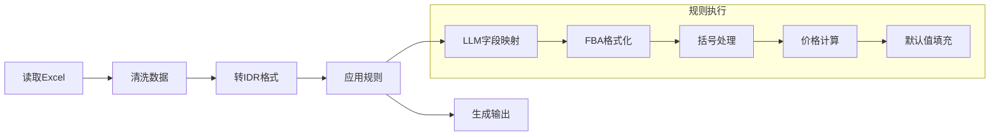

# ExcelConvert 项目结构

## 目录结构

```
ExcelConvert/
├── main.py                 # 主入口
├── README.md               # 项目文档
├── CLAUDE.md               # 开发指南
├── PROJECT_STRUCTURE.md    # 本文件
├── .env.example            # 环境配置模板
├── src/                    # 核心模块
│   ├── __init__.py
│   ├── excel_preprocess.py # Excel预处理
│   ├── excel_to_json.py    # Excel→IDR
│   ├── json_transformer.py # 数据转换（LangGraph）
│   └── json_to_excel.py    # IDR→Excel
├── rules/                  # 动态规则系统
│   ├── __init__.py
│   ├── workflow_builder.py # 工作流引擎
│   ├── nodes_config.yaml   # 规则配置
│   ├── _template.py        # 规则模板
│   ├── field_mapping_llm.py # LLM智能字段映射
│   ├── format_fba_id.py    # FBA格式化
│   ├── replace_parentheses.py # 括号处理
│   ├── calculate_totals.py # 价格计算
│   ├── fill_missing_values.py # 默认值填充
│   ├── price_validation.py # 价格验证示例
│   └── README.md           # 规则开发指南
├── data/                   # 数据流程
│   ├── raw/            # 原始Excel
│   ├── preprocess/     # 预处理后
│   ├── temp/           # IDR格式
│   ├── transformed/    # 转换后JSON
│   └── output/         # 最终Excel
├── docs/                   # 文档目录
│   ├── DEVELOPMENT.md
│   ├── HANDOVER.md
│   ├── PROJECT_STRUCTURE.md
│   ├── README.md
│   ├── REQUIREMENTS.md
│   ├── REQUIREMENTS_TRACKING.md
│   ├── TECHNICAL_ANALYSIS.md
│   └── TECHNICAL_DECISION.md
└── .venv/              # Python虚拟环境
```

## 系统架构

```mermaid
graph TB
    A[原始Excel] --> B[Excel预处理]
    B --> C[Excel→IDR]
    C --> D[规则转换引擎]
    D --> E[IDR→Excel]

    subgraph "数据目录"
        F[data/raw/]
        G[data/preprocess/]
        H[data/temp/]
        I[data/transformed/]
        J[data/output/]
    end

    A -.-> F
    B -.-> G
    C -.-> H
    D -.-> I
    E -.-> J

    subgraph "规则系统"
        K[workflow_builder.py]
        L[nodes_config.yaml]

        subgraph "规则节点"
            N1[field_mapping_llm<br/>LLM智能字段映射]
            N2[format_fba_id<br/>FBA格式化]
            N3[replace_parentheses<br/>括号处理]
            N4[calculate_totals<br/>价格计算]
            N5[fill_missing_values<br/>默认值填充]
        end
    end

    D --> K
    K --> L
    L --> N1
    N1 --> N2
    N2 --> N3
    N3 --> N4
    N4 --> N5
```



## 核心流程



## 使用方式

### 基本命令
```bash
# 最简单：处理所有文件
python main.py

# 处理单个文件
python main.py -i data/test.xlsx

# 跳过预处理
python main.py -i data/clean.xlsx --skip-preprocessing
```

### 添加规则
```bash
# 1. 创建规则
cp rules/_template.py rules/my_rule.py

# 2. 编辑 rules/nodes_config.yaml
# 3. 保存即生效
```

## 技术决策

### 为什么选择LangGraph？
- **状态管理**：天然支持复杂工作流的状态传递
- **流程清晰**：通过配置文件定义执行顺序，便于调试
- **扩展性**：易于添加并行、条件分支等复杂逻辑

### 为什么使用规则系统？
- **灵活性**：无需修改代码即可调整业务逻辑
- **可维护性**：规则独立，便于测试和修改
- **复用性**：规则可在不同场景下组合使用

### 为什么引入LLM智能字段映射？
- **模板适配**：自动识别多种不同的字段名格式，提高系统兼容性
- **减少配置**：无需为每种模板手动配置映射规则
- **智能扩展**：利用 LLM 的语义理解能力，处理未见过的新字段名
- **混合架构**：确定性规则 + AI 智能识别，兼顾准确性和灵活性

### 规则执行顺序

规则按照 `nodes_config.yaml` 中定义的顺序执行，建议顺序：

1. **field_mapping_llm**（LLM字段映射）- 首先统一字段名
2. **format_fba_id**（FBA格式化）- 处理标准化后的字段
3. **replace_parentheses**（括号处理）- 统一中英文字段名
4. **calculate_totals**（价格计算）- 基于标准字段进行计算
5. **fill_missing_values**（默认值填充）- 最后填充缺失值

## 性能考虑

- **内存**：单文件处理，避免内存溢出
- **并发**：文件级别并行处理
- **缓存**：
  - 工作簿缓存机制
  - LLM 字段映射缓存（避免重复调用 API）
- **LLM 优化**：
  - 批量处理多字段，减少 API 调用次数
  - 智能缓存映射结果
  - API 调用失败自动降级

## 扩展方向

1. **规则市场**：社区贡献规则库
2. **Web界面**：规则配置管理
3. **API服务**：提供REST接口
4. **云原生**：容器化部署支持
5. **LLM增强**：
   - 扩展更多 AI 智能规则
   - 支持自定义 LLM 提示词
   - 多模型支持和自动切换