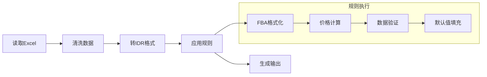

# ExcelConvert 项目结构

## 目录结构

```
ExcelConvert/
├── main.py              # 主入口
├── README.md            # 项目文档
├── CLAUDE.md            # 开发指南
├── PROJECT_STRUCTURE.md # 本文件
├── src/                 # 核心模块
│   ├── __init__.py
│   ├── excel_preprocess.py   # Excel预处理
│   ├── excel_to_json.py      # Excel→IDR
│   ├── json_transformer.py   # 数据转换（LangGraph）
│   └── json_to_excel.py      # IDR→Excel
├── rules/               # 动态规则系统
│   ├── __init__.py
│   ├── workflow_builder.py   # 工作流引擎
│   ├── nodes_config.yaml     # 规则配置
│   ├── _template.py          # 规则模板
│   ├── format_fba_id.py      # FBA格式化
│   ├── replace_parentheses.py # 括号处理
│   ├── calculate_totals.py    # 价格计算
│   ├── fill_missing_values.py # 默认值填充
│   ├── price_validation.py    # 价格验证示例
│   └── README.md             # 规则开发指南
├── data/                # 数据流程
│   ├── raw/            # 原始Excel
│   ├── preprocess/     # 预处理后
│   ├── temp/           # IDR格式
│   ├── transformed/    # 转换后JSON
│   └── output/         # 最终Excel
└── .venv/              # Python虚拟环境
```

## 系统架构

```mermaid
graph TB
    A[原始Excel] --> B[Excel预处理]
    B --> C[Excel→IDR]
    C --> D[规则转换引擎]
    D --> E[IDR→Excel]

    subgraph "数据目录"
        F[data/raw/]
        G[data/preprocess/]
        H[data/temp/]
        I[data/transformed/]
        J[data/output/]
    end

    A -. F
    B -. G
    C -. H
    D -. I
    E -. J

    subgraph "规则系统"
        K[workflow_builder.py]
        L[nodes_config.yaml]
        M[规则模块]
    end

    D --> K
    K --> L
    L --> M
```

## 核心流程



## 使用方式

### 基本命令
```bash
# 最简单：处理所有文件
python main.py

# 处理单个文件
python main.py -i data/test.xlsx

# 跳过预处理
python main.py -i data/clean.xlsx --skip-preprocessing
```

### 添加规则
```bash
# 1. 创建规则
cp rules/_template.py rules/my_rule.py

# 2. 编辑 rules/nodes_config.yaml
# 3. 保存即生效
```

## 技术决策

### 为什么选择LangGraph？
- **状态管理**：天然支持复杂工作流的状态传递
- **流程清晰**：通过配置文件定义执行顺序，便于调试
- **扩展性**：易于添加并行、条件分支等复杂逻辑

### 为什么使用规则系统？
- **灵活性**：无需修改代码即可调整业务逻辑
- **可维护性**：规则独立，便于测试和修改
- **复用性**：规则可在不同场景下组合使用

## 性能考虑

- **内存**：单文件处理，避免内存溢出
- **并发**：文件级别并行处理
- **缓存**：工作簿缓存机制（如果需要）

## 扩展方向

1. **规则市场**：社区贡献规则库
2. **Web界面**：规则配置管理
3. **API服务**：提供REST接口
4. **云原生**：容器化部署支持