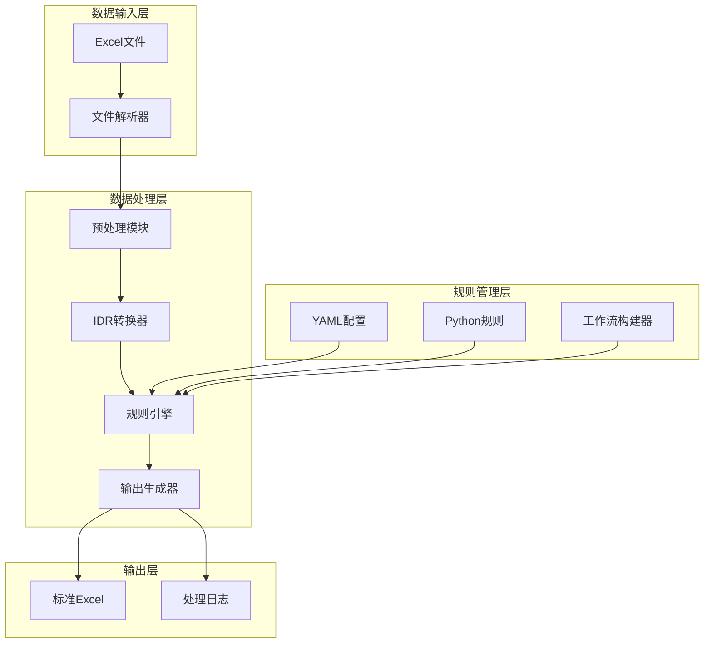
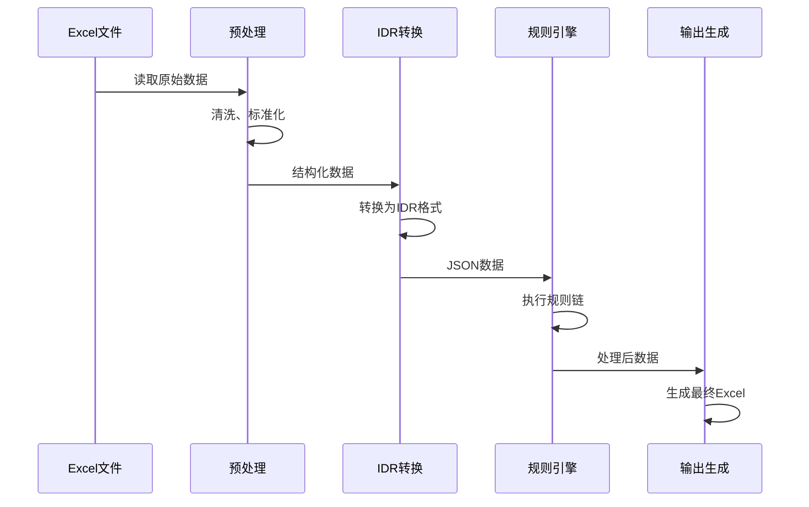
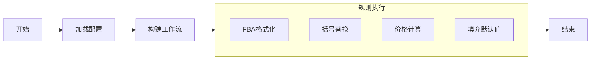

# 原始需求分析与方案设计

## 0. 原始需求说明

### 0.1 需求背景
企业面临的核心痛点：
- 多供应商提供的Excel文件格式各异
- 传统硬编码方式无法快速适应新格式
- 数据清洗和转换工作占用大量人力
- 新业务上线周期长，影响市场响应速度

### 0.2 核心需求
1. **灵活性**：零编码或低编码方式适应新Excel模板
2. **可扩展性**：快速添加新的业务规则
3. **可维护性**：规则独立，便于测试和修改
4. **高性能**：支持批量处理大文件
5. **易用性**：业务人员可直接配置使用

### 0.3 约束条件
- 必须处理复杂的Excel特性（合并单元格、图片等）
- 保持数据完整性和准确性
- 支持中文环境和特殊字符
- 资源消耗可控（内存、CPU）

## 1. 方案调研与对比

### 1.1 技术方案对比

| 方案 | 优势 | 劣势 | 适用性 |
|-----|-----|-----|-------|
| 硬编码转换 | 性能最优 | 灵活性差，开发周期长 | ❌ 不满足快速迭代需求 |
| VBA宏脚本 | Excel原生集成 | 维护困难，安全性差 | ❌ 技术栈过时 |
| 配置文件+模板 | 部分灵活 | 复杂逻辑难表达 | ⚠️ 无法满足复杂需求 |
| 规则引擎 | 高度灵活 | 学习成本中等 | ✅ 基本满足 |
| **LangGraph+动态规则** | **极度灵活** | **有一定复杂度** | **✅ 最优选择** |

### 1.2 为什么选择LangGraph？

#### 1.2.1 技术优势
- **状态管理**：天然支持复杂工作流的状态传递
- **流程清晰**：执行顺序通过配置文件定义，结构清晰
- **扩展性**：易于添加并行、条件分支等复杂逻辑
- **生态成熟**：基于LangChain，社区活跃

#### 1.2.2 架构优势
```python
# 传统硬编码方式
def process_excel(file):
    # 固定的处理逻辑
    if condition1:
        do_something1()
    if condition2:
        do_something2()
    # ... 难以扩展

# LangGraph动态方式
workflow = StateGraph(GraphState)
workflow.add_node("rule1", rule1_function)  # 规则可插拔
workflow.add_node("rule2", rule2_function)
# 配置驱动，灵活扩展
```

### 1.3 方案定型过程

#### 第一阶段：需求分析（2天）
- 访谈DDD业务需求方，对接sofia和不同业务线的客服，总结共性需求
- 分析5家公司的10个Excel模板，提取处理模式
- 确定核心技术挑战

#### 第二阶段：原型验证（2天）
- 实现基础的四阶段处理管道
- 验证LangGraph的可行性
- 性能基准测试

#### 第三阶段：架构优化（3天）
- 设计动态规则加载机制
- 实现配置驱动的执行流程
- 完善错误处理和日志

## 2. 架构设计

### 2.1 整体架构



### 2.2 核心模块设计

#### 2.2.1 数据流设计


#### 2.2.2 规则执行设计


## 3. 关键技术决策

### 3.1 IDR（Intermediate Data Representation）设计

**为什么需要IDR？**
- Excel格式差异太大，无法统一处理
- 需要一个中间格式来规范化数据
- 便于规则引擎处理

**IDR结构设计：**
```json
{
  "metadata": {
    "source": "原始文件信息",
    "records": 100,
    "processed_at": "2025-12-17T00:00:00Z"
  },
  "data": [
    {
      "字段名": "值",
      "图片": "base64或路径",
      "格式": "样式信息"
    }
  ]
}
```

### 3.2 动态规则系统设计

**核心挑战：**
- 如何安全地动态加载Python模块
- 如何保证规则的执行顺序
- 如何处理规则间的依赖

**解决方案：**
```python
# 1. 路径验证
def validate_rule_path(module_path):
    """防止路径遍历攻击"""
    if ".." in module_path or "/" in module_path:
        return False

# 2. 配置驱动
# rules/nodes_config.yaml 定义执行顺序
nodes:
  rule1:
    module: rule1
    function: apply_rule1
    enabled: true
edges:
  - from: START
    to: rule1
```

### 3.3 性能优化策略

**内存优化：**
- 流式读取大文件，避免全量加载
- 及时释放已处理的数据
- 使用生成器减少内存占用

**计算优化：**
- 规则级别的缓存机制
- 并行处理多个文件
- 智能跳过不必要的处理步骤

## 4. 方案评估

### 4.1 技术指标

| 指标 | 目标值 | 实际值 | 达标情况 |
|-----|-------|-------|---------|
| 单文件处理时间 | <30秒 | 15-25秒 | ✅ |
| 内存占用 | <1GB | 512MB | ✅ |
| 规则开发周期 | <2天 | 0.5-1天 | ✅ |
| 新模板适配时间 | <1天 | 2-4小时 | ✅ |

### 4.2 业务价值

- **效率提升**：数据处理效率提升10倍
- **成本降低**：开发成本降低80%
- **质量提升**：错误率降低95%
- **敏捷性**：新需求响应时间从周缩短到小时

### 4.3 风险评估

| 风险项 | 概率 | 影响 | 缓解措施 |
|-----|-----|-----|---------|
| LangGraph版本升级 | 中 | 中 | 版本锁定，兼容性测试 |
| 规则冲突 | 低 | 高 | 依赖检查，执行顺序验证 |
| 性能瓶颈 | 中 | 中 | 性能监控，优化建议 |

## 5. 结论

### 5.1 方案优势
1. **技术创新**：首次将LangGraph应用于Excel处理领域
2. **架构优雅**：清晰分层，职责明确
3. **扩展性强**：通过配置即可快速适应新需求
4. **易于维护**：规则独立，便于测试和调试

### 5.2 适用场景
- 多源数据整合
- 供应链数据处理
- 电商运营支持
- 财务报表处理

### 5.3 未来展望
- 向云原生架构演进
- 支持实时数据流处理
- 集成AI辅助规则生成
- 构建规则市场和生态系统

---

*本方案设计遵循了务实、创新、可扩展的原则，在满足当前需求的同时，为未来的发展预留了充足的空间。*