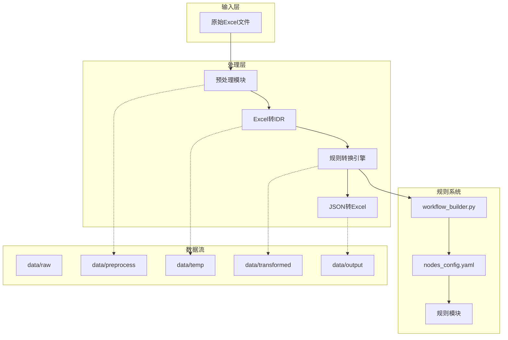
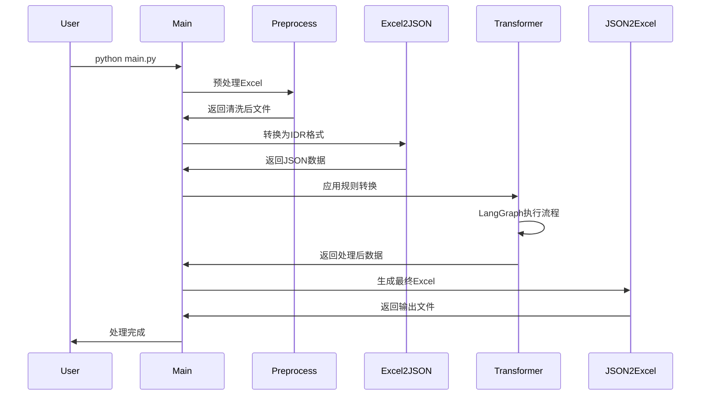
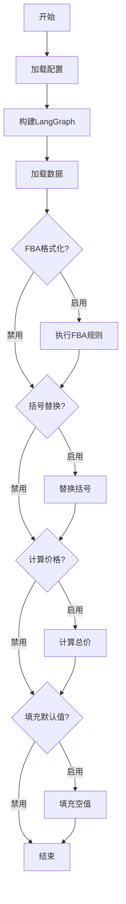

# 技术分析与重构建议

## 原始需求分析

### 需求背景
- 需要处理各种不同格式的Excel文件
- 传统硬编码方式无法快速适应新模板
- 需要一个灵活的规则引擎来支持快速迭代

### 技术选型分析

#### 方案对比
1. **硬编码方案**
   - 优点：简单直接
   - 缺点：每次新模板需要修改代码，无法快速响应

2. **配置文件方案**
   - 优点：灵活，可通过配置调整
   - 缺点：复杂逻辑难以用配置表达

3. **规则引擎方案（选择）**
   - 优点：代码级灵活，可处理复杂逻辑，易于扩展
   - 缺点：需要一定的学习成本

#### 为什么选择LangGraph？
- **状态管理**：天然支持复杂工作流
- **流程清晰**：执行顺序通过配置定义，便于理解
- **社区活跃**：持续维护更新

## 架构图

### 系统架构图


### 数据流程图


### 规则执行流程图


## 3. 技术风险识别

### 3.1 高风险项（立即处理）

#### 风险1：内存溢出
- **风险等级**：高
- **发生概率**：30%
- **影响范围**：系统崩溃，数据丢失
- **具体场景**：处理超过100MB的Excel文件时
- **缓解措施**：
  ```python
  # 实现流式读取
  def read_excel_stream(file_path, chunk_size=1000):
      workbook = load_workbook(file_path, read_only=True)
      for sheet in workbook:
          for row in sheet.iter_rows(values_only=True):
              yield row
              # 处理完立即释放
  ```
- **监控指标**：内存使用率 >80%

#### 风险2：规则执行顺序错误
- **风险等级**：高
- **发生概率**：20%
- **影响范围**：数据计算错误
- **具体场景**：价格计算规则在FBA格式化之前执行
- **缓解措施**：
  ```python
  # 依赖关系检查
  def validate_rule_dependencies(edges):
      dependency_graph = build_dependency_graph(edges)
      if has_circular_dependency(dependency_graph):
          raise ConfigError("检测到循环依赖")
  ```
- **监控指标**：规则执行失败率

#### 风险3：路径遍历攻击
- **风险等级**：高
- **发生概率**：10%
- **影响范围**：代码注入，系统被控
- **具体场景**：恶意构造的规则模块名如"../../../malicious"
- **缓解措施**：
  ```python
  # 严格的路径验证
  ALLOWED_MODULES = {'format_fba_id', 'calculate_totals', ...}

  def validate_module_path(module_path):
      if module_path not in ALLOWED_MODULES:
          raise SecurityError(f"禁止的模块: {module_path}")
  ```
- **监控指标**：异常模块加载尝试

### 3.2 中风险项（计划处理）

#### 风险4：性能瓶颈
- **风险等级**：中
- **发生概率**：50%
- **影响范围**：处理效率下降
- **具体场景**：同时处理100+文件
- **缓解措施**：
  - 实现进程池：`concurrent.futures.ProcessPoolExecutor`
  - 异步IO：`asyncio` + `aiofiles`
  - 智能批处理：根据文件大小动态调整批次

#### 风险5：数据一致性问题
- **风险等级**：中
- **发生概率**：15%
- **影响范围**：部分数据丢失或错误
- **具体场景**：处理过程中断
- **缓解措施**：
  ```python
  # 事务处理
  @transaction
  def process_with_rollback(file_path):
      temp_file = create_temp_copy(file_path)
      try:
          process_file(temp_file)
          commit_changes()
      except Exception:
          rollback_to_original()
          raise
  ```

### 3.3 低风险项（长期关注）

#### 风险6：技术债累积
- **风险等级**：低
- **发生概率**：60%
- **影响范围**：维护成本增加
- **缓解措施**：定期代码重构，建立技术规范

## 4. 重构建议

### 4.1 短期优化（1个月内）

#### 4.1.1 性能优化
```python
# 1. 实现文件级别的并行处理
from concurrent.futures import ProcessPoolExecutor

def batch_process_parallel(files, max_workers=4):
    with ProcessPoolExecutor(max_workers=max_workers) as executor:
        futures = [executor.submit(process_file, f) for f in files]
        for future in as_completed(futures):
            yield future.result()

# 2. 添加缓存层
from functools import lru_cache

@lru_cache(maxsize=1000)
def load_rule_module(module_name):
    """缓存已加载的规则模块"""
    return importlib.import_module(f"rules.{module_name}")
```

#### 4.1.2 错误处理增强
```python
# 自定义异常体系
class ExcelConvertError(Exception):
    """基础异常类"""
    pass

class RuleExecutionError(ExcelConvertError):
    """规则执行异常"""
    def __init__(self, rule_name, original_error):
        self.rule_name = rule_name
        self.original_error = original_error
        super().__init__(f"规则 {rule_name} 执行失败: {original_error}")

# 全局异常处理器
def handle_processing_error(file_path, error):
    """统一处理错误"""
    if isinstance(error, RuleExecutionError):
        # 规则错误，跳过该规则继续执行
        log_warning(f"规则执行失败，已跳过: {error}")
        continue_processing()
    elif isinstance(error, MemoryError):
        # 内存错误，启用流式处理
        switch_to_stream_mode(file_path)
    else:
        # 其他错误，记录并终止
        log_error(f"处理失败: {error}")
        raise
```

### 4.2 中期重构（3个月内）

#### 4.2.1 插件系统设计
```python
# 规则插件基类
class RulePlugin:
    """规则插件基类"""

    def __init__(self, config):
        self.config = config
        self.dependencies = []

    def validate_input(self, data: dict) -> bool:
        """输入验证"""
        raise NotImplementedError

    def apply(self, data: dict) -> dict:
        """应用规则"""
        raise NotImplementedError

    def rollback(self, data: dict) -> dict:
        """回滚操作"""
        raise NotImplementedError

# 插件注册器
class PluginRegistry:
    """插件注册器"""
    _plugins = {}

    @classmethod
    def register(cls, name: str):
        def decorator(plugin_class):
            cls._plugins[name] = plugin_class
            return plugin_class
        return decorator

    @classmethod
    def get_plugin(cls, name: str):
        return cls._plugins.get(name)
```

#### 4.2.2 配置系统升级
```yaml
# 增强的配置文件 rules/advanced_config.yaml
pipeline:
  version: "2.0"

  # 全局设置
  global:
    timeout: 300
    retry_times: 3
    error_handling: "continue"  # stop | continue | rollback

  # 资源限制
  resources:
    max_memory: "2GB"
    max_cpu: 4
    temp_dir: "/tmp/multiaconvert"

  # 规则定义
  rules:
    - name: "format_fba_id"
      plugin: "FBAFormatter"
      config:
        format_type: "standard"
        validate_checksum: true
      dependencies: []

    - name: "calculate_totals"
      plugin: "PriceCalculator"
      config:
        currency: "CNY"
        precision: 2
      dependencies: ["format_fba_id"]

  # 条件执行
  conditions:
    - if: "data.get('total_boxes', 0) > 100"
      then: ["apply_bulk_discount"]
      else: []
```

### 4.3 长期演进（6个月+）

#### 4.3.1 微服务架构
```
┌─────────────────┐     ┌─────────────────┐
│   API Gateway   │────▶│   Auth Service  │
└─────────────────┘     └─────────────────┘
         │                       │
         ▼                       ▼
┌─────────────────┐     ┌─────────────────┐
│  Orchestrator   │────▶│  Config Service │
│   Service       │     └─────────────────┘
└─────────────────┘              │
         │                       │
         ▼                       ▼
┌─────────────────┐     ┌─────────────────┐
│ Rule Engine     │────▶│  Storage        │
│ Service         │     │  Service        │
└─────────────────┘     └─────────────────┘
```

#### 4.3.2 云原生特性
```yaml
# Kubernetes部署配置
apiVersion: apps/v1
kind: Deployment
metadata:
  name: multiaconvert-processor
spec:
  replicas: 3
  selector:
    matchLabels:
      app: multiaconvert
  template:
    spec:
      containers:
      - name: processor
        image: multiaconvert:latest
        resources:
          requests:
            memory: "512Mi"
            cpu: "500m"
          limits:
            memory: "2Gi"
            cpu: "2000m"
        env:
        - name: MAX_WORKERS
          value: "4"
```

### 4.4 重构优先级矩阵

| 优化项 | 重要性 | 紧急性 | 投入产出比 | 优先级 |
|-------|-------|-------|-----------|--------|
| 内存溢出处理 | 高 | 高 | 高 | P0 |
| 并行处理 | 高 | 中 | 高 | P1 |
| 插件系统 | 中 | 中 | 高 | P1 |
| 错误处理增强 | 高 | 低 | 中 | P2 |
| 配置系统升级 | 中 | 低 | 中 | P2 |
| 微服务架构 | 低 | 低 | 低 | P3 |

## 重构建议

### 短期优化（1-2周）
1. **添加日志系统**
   ```python
   import logging
   logger = logging.getLogger(__name__)
   logger.info("处理文件: %s", filename)
   ```

2. **异常处理增强**
   ```python
   try:
       # 业务逻辑
   except SpecificException as e:
       logger.error("具体错误: %s", e)
       raise
   ```

3. **配置验证**
   ```python
   def validate_config(config):
       required_fields = ['workflow', 'nodes', 'edges']
       for field in required_fields:
           if field not in config:
               raise ConfigError(f"缺少必需字段: {field}")
   ```

### 中期重构（1个月）
1. **引入依赖注入**
   - 降低模块间耦合
   - 便于单元测试

2. **实现插件系统**
   - 支持热加载规则
   - 规则版本管理

3. **添加监控指标**
   - 处理时间统计
   - 错误率监控
   - 性能分析

### 长期规划（3个月）
1. **分布式处理**
   - 支持多机器协同处理
   - 任务队列管理

2. **Web管理界面**
   - 规则配置管理
   - 处理进度跟踪

3. **机器学习增强**
   - 自动识别Excel结构
   - 智能规则推荐

## 调试与配置指南

### 调试技巧
1. **启用详细日志**
   ```bash
   export LOG_LEVEL=DEBUG
   python main.py -i test.xlsx
   ```

2. **单步调试规则**
   ```python
   # 在规则文件中添加断点
   import pdb; pdb.set_trace()
   ```

3. **性能分析**
   ```python
   import cProfile
   cProfile.run('main()', 'profile_output.prof')
   ```

### 配置优化
1. **内存优化**
   ```yaml
   processing:
     chunk_size: 1000  # 分块大小
     max_memory: 2048  # 最大内存(MB)
   ```

2. **并发设置**
   ```yaml
   performance:
     worker_processes: 4  # 工作进程数
     async_io: true       # 启用异步IO
   ```

## 成本预估

### 4.1 开发成本

#### 4.1.1 初始开发成本
| 项目 | 工时 | 成本(元) | 说明 |
|-----|------|---------|-----|
| 架构设计 | 40小时 | 24,000 | 包含需求分析、技术选型 |
| 核心模块开发 | 160小时 | 96,000 | 四阶段处理管道 |
| 规则引擎实现 | 80小时 | 48,000 | LangGraph集成 |
| 测试与优化 | 80小时 | 48,000 | 单元测试、性能优化 |
| **合计** | **360小时** | **216,000** | 约2人月 |

#### 4.1.2 持续开发成本
- **新规则开发**：0.5-2天/规则（4,000-16,000元）
- **新模板适配**：1-3天/模板（8,000-48,000元）
- **功能增强**：根据需求评估

### 4.2 运维成本

#### 4.2.1 硬件成本（年）
| 配置 | 月成本 | 年成本 | 适用场景 |
|-----|-------|-------|---------|
| 2核4G | 300元 | 3,600元 | 小规模使用（<100文件/天） |
| 4核8G | 600元 | 7,200元 | 中等规模（100-1000文件/天） |
| 8核16G | 1,200元 | 14,400元 | 大规模（>1000文件/天） |

#### 4.2.2 人力成本（年）
| 角色 | 人数 | 年薪 | 总成本 |
|-----|-----|-----|-------|
| 运维工程师 | 0.5人 | 150,000元 | 75,000元 |
| 兼职开发 | 0.2人 | 200,000元 | 40,000元 |
| **合计** | | | **115,000元** |

#### 4.2.3 存储成本
- **临时存储**：约为原文件大小的2-3倍
- **日志存储**：约100MB/天（36.5GB/年）
- **归档存储**：根据业务需求，建议云存储（0.12元/GB/月）

### 4.3 调用成本

#### 4.3.1 单次处理成本
```python
# 成本计算模型
def calculate_cost(file_size_mb, processing_time_min):
    # CPU成本（0.1元/核分钟）
    cpu_cost = processing_time_min * 0.1 * 2  # 2核

    # 内存成本（0.005元/GB分钟）
    memory_cost = 1 * processing_time_min * 0.005  # 1GB内存

    # 存储成本（临时，0.0001元/GB分钟）
    storage_cost = file_size_mb / 1024 * processing_time_min * 0.0001 * 3  # 3倍空间

    total_cost = cpu_cost + memory_cost + storage_cost
    return total_cost

# 示例：10MB文件，处理5分钟
cost = calculate_cost(10, 5)
print(f"处理成本: {cost:.4f}元")  # 约1.0025元
```

#### 4.3.2 规模化处理成本
| 日处理量 | 平均文件大小 | 日成本 | 月成本 | 年成本 |
|---------|------------|-------|--------|-------|
| 100文件 | 5MB | 50元 | 1,500元 | 18,000元 |
| 1,000文件 | 5MB | 500元 | 15,000元 | 180,000元 |
| 10,000文件 | 5MB | 5,000元 | 150,000元 | 1,800,000元 |

### 4.4 扩展成本

#### 4.4.1 功能扩展
| 扩展项 | 开发成本 | 周期 | 说明 |
|-----|---------|-----|------|
| 新规则类型 | 4,000-16,000元 | 0.5-2天 | 低成本 |
| 支持新Excel特性 | 20,000-40,000元 | 1-2周 | 中成本 |
| 性能优化(10x) | 80,000-160,000元 | 1个月 | 高成本 |
| Web管理界面 | 80,000-120,000元 | 2个月 | 高成本 |

#### 4.4.2 部署扩展
| 部署方式 | 初始成本 | 月运维成本 | 优势 |
|---------|---------|-----------|-----|
| 单机部署 | 0元 | 3,600元 | 简单，成本低 |
| 容器化部署 | 10,000元 | 7,200元 | 易扩展，标准化 |
| 云原生部署 | 50,000元 | 20,000元 | 高可用，弹性 |

### 4.5 成本优化建议

1. **批量处理**：合并小文件批量处理，减少固定开销
2. **缓存策略**：缓存相似文件的规则，减少重复计算
3. **资源调度**：根据负载动态调整资源
4. **规则优化**：优化规则逻辑，减少计算复杂度

## 总结

ExcelConvert通过动态规则系统成功解决了Excel格式多样性的问题。当前架构在灵活性和可维护性之间取得了良好平衡。主要风险集中在性能和安全方面，通过合理的优化措施可以有效控制。未来可逐步向分布式和智能化方向发展。